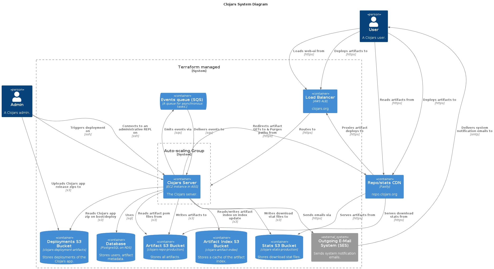

# Clojars Server Config

This repo contains the Ansible config for building the AMI for the
Clojars server, the terraform for managing the Clojars
infrastructure on AWS, and scripts to deploy a Clojars release.

# System Diagram



# Setup

## AWS Credentials

You will also need a AWS access key, exported as `AWS_ACCESS_KEY_ID`
and `AWS_SECRET_ACCESS_KEY`. These vars need to be set to run
terraform, build an AMI, or deploy. You will also need to set
`CLOJARS_SSH_KEY_FILE` to the path to the private key used by the
server if you want to deploy or ssh in to the server.

To apply the terraform, you will need two configuration vars set in
your environment: `TF_VAR_db_password` and `TF_VAR_db_username`. Both
of these values are available from `aws-ansible/private/vars.yml`.

### clojars-env script

One way to have all those vars set is to create a wrapper script that
sets them (called `clojars-env` in this example):

```sh
#!/bin/bash

export AWS_ACCESS_KEY_ID=ASDFASDFASDF
export AWS_SECRET_ACCESS_KEY=3ASD3434AA
export AWS_REGION=us-east-2
export CLOJARS_SSH_KEY_FILE=~/.ssh/clojars-server.pem

export TF_VAR_db_password=asdfasdfasfdsadf
export TF_VAR_db_username=foo

exec $@

```

Then execute commands with:

`clojars-env terraform apply` 

### direnv

Alternatively, you can use [direnv](https://direnv.net/) to set 
the environment variables.

Create a `.envrc` file at the root of the repo:

```
export AWS_ACCESS_KEY_ID=ASDFASDFASDF
export AWS_SECRET_ACCESS_KEY=3ASD3434AA
export AWS_REGION=us-east-2
export CLOJARS_SSH_KEY_FILE=~/.ssh/clojars-server.pem

export TF_VAR_db_password=asdfasdfasfdsadf
export TF_VAR_db_username=foo
```

Install direnv and run `direnv allow` in the repo directory. Now, 
everytime you cd into the repo directory, the environment variables 
will be set.

## Terraform

You will need terraform installed to be able to apply changes to the
infrastructure: https://www.terraform.io/downloads.html (currently
using v0.14.2).

### Initialization

The terraform state is stored in S3 and uses a DynamoDB table to lock
that state when it is being altered. On first run, you will need to
initialize terraform with:

```sh
cd terraform
terraform init
```
### Applying the configuration

```sh
cd terraform
terraform apply
```

## Packer

You will need packer installed to be able to build AMIs:
https://www.packer.io/downloads.html (currently using v1.5.4).

## Private Vars

There is some config for Clojars which is sensitive and cannot be
publicly shared in the Github repo. This is placed in
`aws-ansible/private/vars.yml`. For development purposes,
`aws-ansible/private_vars.yml.example` is a vars file which looks like
the real one but with sensitive information replaced. These vars are
used by the ansible that builds the AMI.

# Listing running instances

There is a convenience script to list all EC2 instances:

`scripts/list-instances.sh`

# Deployment

To deploy a new release of Clojars, you have a few options:

- You can build and upload a new release to S3, then deploy a new AMI
  that will pick up the release (see below)
- You can build and upload a new release to S3, then request that a
  running server switch to that release
- You can also switch back to an older release

To build and upload a new release, run:

`scripts/upload-release.sh <version-tag>`

This will check to see if an artifact for that tag already exists in
the deployment bucket. If not, it will pull down the tag from GitHub,
build an uberjar, then upload a zip containing that uberjar and the
`scripts/` dir from `clojars-web` to the deployment bucket. 

It then writes a `current-release.txt` containing the tag to the
deployment bucket.

To deploy a release to a running server, run:

`scripts/deploy.sh <server-ip> <version-tag>`

This will first call `scripts/upload-release.sh`, then ssh to the
server and run the [deploy-clojars
script](./aws-ansible/roles/clojars/files/bing-scripts/deploy-clojars). This
script will pull down the version specified by `current-release.txt`
and deploy it. This script is the same script that runs when the
Clojars AMI boots.

# Building an AMI

We build a custom AMI using packer, and apply changes to the AMI with
ansible. To run packer, call:

`scripts/build_ami.sh`

This will take a few minutes, but will produce a new AMI. See the
final output from packer to get the AMI ID.

# Deploying a new AMI

1. Edit `terraform/main.tf`, setting the `image_id` in the
   `prod_launch_config` to the new AMI. AMI changes to a launch
   configuration don't affect *running* instances, so we will have to
   force a new instance.
2. Start an instance refresh. This will create a new instance, wait for
   health checks to pass, and then terminate the old instance.
   ```sh
   aws autoscaling start-instance-refresh --auto-scaling-group-name=prod-asg
   ```

## Ansible Guidelines

* Follow Ansible [best practices](http://docs.ansible.com/ansible/playbooks_best_practices.html)
* Add an `{{ ansible_managed }}` comment in the header of all templates and files
* Place any private files in `aws-ansible/private/`


Distributed under the MIT License. See the file COPYING.
